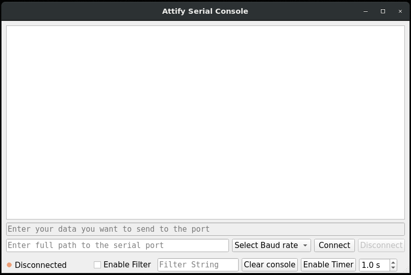

# Attify badge tool

Attify badge tool requires Python 3.

## Installation

```
$ git clone https://github.com/attify/attify-badge-tool
$ cd attify-badge-tool
$ pip3 install -r requirements.txt
```

Alternatively you can download a precompiled appimage binary from **[releases](https://github.com/attify/attify-badge-tool/releases)**

## Running

```
$ python3 serial-console.py
```

## Screenshot



## Usage

- Enter the path to the serial port, select a baud rate and press connect.
- To send a command to the port, type in the upper text box and hit Enter.
- To clear the screen, press "Clear Console".
- The "Enable Filter" option turns on string filtering. Any line containing the filter string is not displayed.
- The "Enable Timer" option starts a timer window for the given number of seconds. Every time you send a command to the port, the window opens for the specified time. Messages received within the time frame are displayed. Anything received after the window has been closed are discarded.
